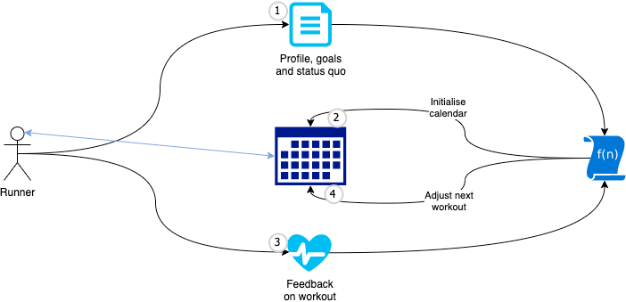

# Running with Jack Daniels
**Collection of functions to calculate running velocities and training calendar according to Jack Daniels Running Formula.**

Jack Daniels did many things in sports as you can check out on [Wikipedia](https://en.wikipedia.org/wiki/Jack_Daniels_(coach)).
He especially founded a way to measure running success and build your trainings plans, track workouts and adjust your plans for setbacks after breaks. This all works, based on one simple indicator: VDOT.

Tables exist, mainly taken from the book [Jack Daniels Running Formula](https://books.google.de/books/about/Daniels_Running_Formula.html?id=ovN6DwAAQBAJ&source=kp_book_description&redir_esc=y), that can tell you your VDOT and let you choose your training valocities. One out of many good examples is this one from [Carsten Schulz](https://carsten.codimi.de/daniels.html) which also contains a calculator.

Reading the book you realize, that Jack has given us detailed material to calculate for all steps of a runners season. No matter if you just started or if you're a very experienced runner. If you want to take it serious, if you like to measure your success, VDOT is the performance indicator to go.

## Content
This repository contains a set of back-end functions to calculate all necessary results along the four areas of setting the goal and knowing your status quo, plan your season, track your workouts and adjust when it gets possible (raise) or necessary (lower intensity).

The four areas come along three levels of precision:
1. **Macrolevel** defines a season and the goals like some particular race or fitness improvements along with planned breaks.
2. **Midilevel** lays out a plan for each week and how to mix quality trainings and recovery days into your weekly schedule.
3. **Microlevel** defines what should happen within a each single workout. 

Each area at each level has its own data, which can be input-, output or calculated data:

|| Macrolevel (Season) | Midilevel (Week) | Microlevel (Workout) |
| --- | --- | --- | --- |
|  | Planned breaks, vacation | Constraints per week, preferred training-days, - times, -durations, -distances | Current vdot, HRmax, BMI |
|  | Race/competition or fitness improvement? - Race: Distance, date - Fitness: Distance, duration at end of season |
|  | Phases over weeks | Workouts: weekday, durations, Quality vs easy, workout-duration | Intensities (order, duration, speed) |
|  | Trends: - estimated vdot | Points: - The more intensity, the more points The longer, the more points - 70% minimum E is must | vdot estimation: - HR% = HR / HRmax - vdot% = table(HR%) - vdot = table(speed, intensity) - vdot% compared to vdot How do you feel today? (Before) How did you make it? (After) |
|  | AdHoc-replanning along fulfillments along plan | AdHoc-replanning along past feelings, gaps (setback), fulfillments along plan | AdHoc-replanning along todays feeling, estimated vdot in last workouts |

## Two inputs and a dynamic output

Basically, the functions work in this order:
1. You start by telling the system your preferences, goals and what you know about your status quo.
2. The system lays out a trainings plan. It considers your preferences and the timing of your goals. The planned workouts are initially set with intensities, durations etc.
3. Execute along the plan and track your workouts. Provide the system before and after each workout with additional information.
4. The system takes your information, adds the information about gaps (actually, when information is missed) and adjusts your plan accordingly

## Your routines
This defines the runners routine to work with these functions - actually with an app, that is based on these functions.

1. One time per season:
   - Setup: Define your profile, goals, preferences for the weekly schedule and planned or known breaks. This is done by editing the according `yaml` files, that you find in the `input` directory. Store the result and have a look into it. As some values like the `HRmax` is a default calculation you can override it if you have some more accurate number. Same applies for the estimated VDOT.
   - Plan your season with the `planSeason` function. The result is a number of `.ics` Calendar entries. Use your favourite calendar app to get reminded about your workouts. The intensities listed in the calendar are initial values. Your actual workout-plan for a day is given to you by `planWorkout` which considers the past performance, breaks etc.
1. Before a workout
   - Plan the workout for today with the `planWorkout` function.
1. After a workout
   - Run `trackWorkout` with your traking data like HR and velocity. Store the result as you will need it for all future calls to `planWorkout`.
3. As often as you like 
   - Run `getStats` and check trends in your performance.

# What the functions in this repo are NOT handling
Out of scope for the functions in this repository is anything around security and data handling.
- The functions do not store any information about you or your workouts. They're all stateless and work along the data you provide them.
- The functions do not care about any authentication or authorization. If you embedd them in an app, you must ensure that some kind of API-Management and security layer enforce GDPR, local or global laws and privacy.

